    

# 哔哩哔哩网页版展示 IP 属地
# Bilibili-Web-Show-IP-Address

> 我不喜欢 IP 属地，但是你手机都显示了，为什么电脑不显示呢？

目前支持的场景有：视频（普通视频、番剧（影视）、收藏列表）、动态评论区、个人主页动态。

仅测试于 Chrome 113 / Safari 16.4。**需要使用支持 [unsafeWindow](https://www.tampermonkey.net/documentation.php#api:unsafeWindow) API 的脚本管理器**

个人主页动态使用了 [Navigation Property](https://developer.mozilla.org/en-US/docs/Web/API/Window/navigation) 兼容性可能存在问题，后期会寻找替代。

## 安装

[[Greasy Fork](https://greasyfork.org/zh-CN/scripts/466815)] [[Github Release](https://github.com/MaxChang3/Bilibili-Web-Show-IP-Address/releases/latest/download/bilibili-web-show-ip-address.user.js)]

## 原理图

    

## 感谢

参考了部分 [B站评论区开盒](https://greasyfork.org/zh-CN/scripts/448434) 的代码。
